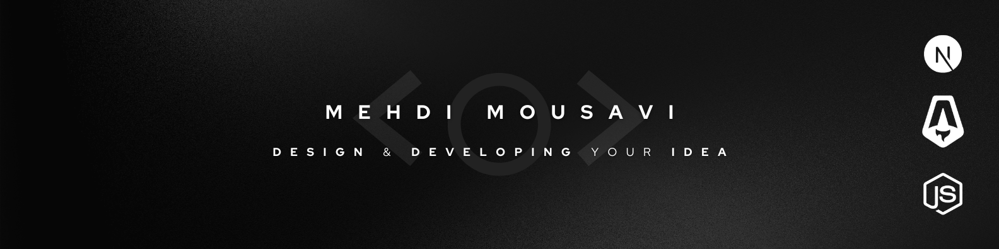

**About me**

- 💼 I'm working at <a href="https://arseskara.site/" target="_blank">Arses</a>
- ❤️ I Love JS
- 👨🏾‍💻 I’m currently learning NestJS & DB
- you can connect with me by email ---> mmmousavi.p@gmail.com

<!---
mahdi-mm/mahdi-mm is a ✨ special ✨ repository because its `README.md` (this file) appears on your GitHub profile.
You can click the Preview link to take a look at your changes.
--->
